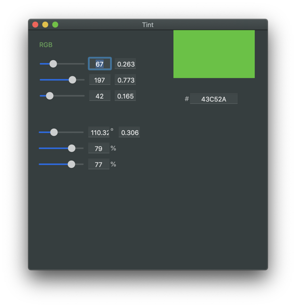

# Tint

Tint is a handy color generator/picker for developers.

### Screenshot

### Usage

* Move the RGB and HSB sliders, or enter values in the respective fields to find a color.
* Use the swatch at the top right for previewing.
* When you change the RGB value, the HSB value will update accordingly, and vice versa.
